class: title-slide

```{r setup 1, echo=FALSE, message=FALSE, warning=FALSE}
knitr::opts_chunk$set(
  echo        = FALSE,
  message     = FALSE,
  warning     = FALSE,
  fig.align   = "center",
  out.width   = "100%",
  dev         = "png",
  dpi         = 150,
  cache       = FALSE
)

suppressPackageStartupMessages({
  library(dplyr)
  library(ggplot2)
  library(tidyr)
  library(patchwork)
  library(knitr)
  library(kableExtra)
  library(scales)
  library(tibble)
  library(RefManageR)
  library(magick)
  library(plotly)
  library(sf)
  library(stringr)
  library(leaflet)
  library(osrm)
  library(ROI)
  library(ROI.plugin.glpk)
  library(gurobi)
  library(ROI.plugin.gurobi)
  library(ggrepel)
  library(ggnewscale)
  library(rnaturalearth)
  library(rnaturalearthdata)
  library(Rcpp)
  library(RcppArmadillo)
  library(scatterpie)
  library(networkD3)
  library(htmlwidgets)
  library(webshot2)
  library(ggalluvial)
  library(xaringanExtra)
  library(collapsibleTree)
  library(tikzDevice)
  library(pdftools)
})

xaringanExtra::use_logo(
  image_url = "fig/logo_hsrm.png",
  width      = "200px",
  height     = "auto",
  position   = xaringanExtra::css_position(top = "10px", right = "15px"),
  exclude_class = c()  # Logo auf Sektionsfolien ausblenden c("inverse")
)

xaringanExtra::use_progress_bar(
  color    = "#5E3EE1",   # HSRM-Violett
  location = "top",
  height   = "4px"
)

xaringanExtra::use_tile_view()       # Folienübersicht mit 'O'
xaringanExtra::use_broadcast()       # Präsentation synchronisieren

# ── RefManageR: Automatisches Literaturverzeichnis ────────────────────────────
BibOptions(
  check.entries = FALSE,
  bib.style     = "authoryear",
  cite.style    = "authoryear",
  style         = "markdown",
  hyperlink     = FALSE,
  dashed        = FALSE,
  max.names =2,
  longnamesfirst = FALSE
)
bib <- ReadBib("literature.bib", check = FALSE)

```


```{r setup-2, echo=FALSE, message=FALSE, warning=FALSE, cache=TRUE}
zulassung_dtlnd_lwk <- matrix(
c(2022, 253894,	21633,		18322,	30,	  77,	  2245,	0,
2023,	  290693,	25330,		21790,	126,	31,	  2591,	1,
2024, 	316928,	20524,		17007,	100,	277,	2344,	1,
2025, 	295595,	36366,		27275,	107,	6191,	1669,	2)
, nrow= 4, byrow=T)

colnames(zulassung_dtlnd_lwk) <- c("Jahr", "gesamt", "alternativ", "BEV","FC", "PHEV", "LNG", "H2") 

# ============================================================
# VRP - Alle Lösungen: Kostenberechnung + Visualisierung
# ============================================================
# Problemstellung:
#   Flotte: 1 C-Truck (konventionell), 1 E-Truck (elektrisch)
#   Kapazität je Fahrzeug: 2 TEU | Je Auftrag: 1 TEU
#   Kunden: A(3,7), B(6,-5), C(0,-2), D(1,1) | Depot: (0,0)
#   C-Truck: 1 €/km, 1 kg CO2e/km
#   E-Truck: 1.5 €/km, 0.2 kg CO2e/km
#   Kostensensitiv (schwarz): A, D
#   Umweltsensitiv (grün):    B, C
# ============================================================

# ---- 1. PARAMETER UND HILFSFUNKTIONEN ----------------------

depot <- c(x = 0, y = 0)

nodes <- list(
  A = c(x =  3, y =  7),
  B = c(x =  6, y = -5),
  C = c(x =  0, y = -2),
  D = c(x =  1, y =  1)
)

# Fahrzeugparameter
c_cost_per_km <- 1.0     # € pro km, C-Truck
c_emis_per_km <- 1.0     # kg CO2e pro km, C-Truck
e_cost_per_km <- 1.5     # € pro km, E-Truck (1.5x C-Truck)
e_emis_per_km <- 0.2     # kg CO2e pro km, E-Truck (0.2x C-Truck)

# Kundenpräferenzen
cost_sensitive <- c("A", "D")   # schwarz
env_sensitive  <- c("B", "C")   # grün

# Euklidische Distanz
dist_euclid <- function(p1, p2) {
  sqrt((p1["x"] - p2["x"])^2 + (p1["y"] - p2["y"])^2)
}

# Tourdistanz: Depot -> k1 -> k2 -> Depot
tour_dist <- function(k1, k2) {
  dist_euclid(depot, nodes[[k1]]) +
    dist_euclid(nodes[[k1]], nodes[[k2]]) +
    dist_euclid(nodes[[k2]], depot)
}

# Direktdistanzen Depot -> Kunde (für Kostenallokation)
direct_dist <- sapply(names(nodes), function(k) dist_euclid(depot, nodes[[k]]))
names(direct_dist) <- LETTERS[1:4]

# Allokationsgewichte: Anteil der Direktdistanz an Summe beider Direktdistanzen
alloc_shares <- function(k1, k2) {
  d1 <- direct_dist[k1]
  d2 <- direct_dist[k2]
  c(w1 = d1 / (d1 + d2), w2 = d2 / (d1 + d2))
}

# ---- 2. ALLE TOURENPLÄNE BERECHNEN -------------------------

customers <- c("A", "B", "C", "D")

# Alle eindeutigen Partitionen in 2 Gruppen à 2 Kunden (3 Partitionen)
all_combos <- combn(customers, 2, simplify = FALSE)
partitions <- list()

for (combo in all_combos) {
  partitions[[length(partitions) + 1]] <- list(group1 = combo, group2 = setdiff(customers, combo))
}

tours <- matrix(unlist(partitions), ncol=4, byrow=T)


perf.tours <- apply(tours, 1, function(x){
  # length of tours
  c.tour <- tour_dist(x[1],x[2])
  e.tour <- tour_dist(x[3],x[4])
  # cost and emissions of C-tour
  cost.c.tour <- c.tour * c_cost_per_km
  emis.c.tour <- c.tour * c_emis_per_km
  # cost and emissions of e-tour
  cost.e.tour <- e.tour * e_cost_per_km
  emis.e.tour <- e.tour * e_emis_per_km
  # allocated costs and emissions of C-tour
  alloc.cost.c.tour <- cost.c.tour * alloc_shares(x[1],x[2])
  alloc.emis.c.tour <- emis.c.tour * alloc_shares(x[1],x[2])
  names(alloc.cost.c.tour) <- names(alloc.emis.c.tour) <- x[1:2]
  # allocated costs and emissions of E-tour
  alloc.cost.e.tour <- cost.e.tour * alloc_shares(x[3],x[4])
  alloc.emis.e.tour <- emis.e.tour * alloc_shares(x[3],x[4])
  names(alloc.cost.e.tour) <- names(alloc.emis.e.tour) <- x[3:4]
  
  # allocated emissions and costs
  alloc.cost <- c(alloc.cost.c.tour, alloc.cost.e.tour)
  alloc.emis <- c(alloc.emis.c.tour, alloc.emis.e.tour)
  # total cost & total emissions
  total.cost <- sum(alloc.cost)
  total.emis <- sum(alloc.emis)
  
  res <- c(total.cost, total.emis, 
           alloc.cost["A"], alloc.emis["A"],
           alloc.cost["B"], alloc.emis["B"],
           alloc.cost["C"], alloc.emis["C"],
           alloc.cost["D"], alloc.emis["D"]
           )
  
  names(res) <- NULL
  
  return(res)
})

perf.tours <- t(perf.tours)

# data frame of tours 

res.df <- data.frame("C-Tour"=rep("A",nrow(perf.tours)), "E-Tour"=rep("A",nrow(perf.tours)), perf.tours)

res.df$C.Tour <- apply( tours[,1:2] , 1, function(x) paste(x, collapse = ","))

res.df$E.Tour <- apply( tours[,3:4] , 1, function(x) paste(x, collapse = ","))

colnames(res.df) <- c("C.Tour", "E.Tour","TC", "TE", 
                      "C.A", "E.A",
                      "C.B", "E.B", 
                      "C.C", "E.C",
                      "C.D", "E.D"
                      )


plot_vrp_ggplot <- function(tour.id = 3, touri = res.df, aspect.ratio = 0.5) {
  
  tmp.tour <- touri[tour.id, ]
  
  x <- as.character(tmp.tour[1])
  y <- as.character(tmp.tour[2])
  
  tot.cost <- round(as.numeric(tmp.tour[3]),1)
  tot.emis <- round(as.numeric(tmp.tour[4]),2)
  
  coords <- as.data.frame(rbind(depot, t(as.data.frame(nodes))))
  coords <- rownames_to_column(coords, var = "name")
  coords$type <- c("depot","cost","env","env","cost")
  
  alloc.mat <- matrix(tail(as.numeric(tmp.tour),8), ncol=2, byrow=T)
  
  coords$alloc.cost <- c(0,alloc.mat[,1])
  coords$alloc.emis <- c(0,alloc.mat[,2])
  
  parse_route <- function(tour_str) {
    tour <- unlist(strsplit(tour_str,","))
    nms <- c("depot", tour[1], tour[2], "depot")
    do.call(rbind, lapply(nms, function(n) coords[coords$name == n, ]))
  }

  c_route <- parse_route(x); c_route$truck <- "C-Truck"
  e_route <- parse_route(y); e_route$truck <- "E-Truck"
  routes  <- rbind(c_route, e_route)

  # Segmente für Pfeile
  make_segs <- function(r) {
    data.frame(x    = head(r$x, -1), y    = head(r$y, -1),
               xend = tail(r$x, -1), yend = tail(r$y, -1),
               truck = head(r$truck, -1))
  }
  segs <- rbind(make_segs(c_route), make_segs(e_route))

  ggplot() +
    geom_segment(data = segs,
                 aes(x=x, y=y, xend=xend, yend=yend, color=truck),
                 arrow = arrow(length = unit(0.25,"cm"), type = "closed"),
                 linewidth = 1.2) +
    geom_point(data = coords[coords$type == "depot", ],
               aes(x, y), shape = 15, size = 5, color = "grey30") +
    geom_point(data = coords[coords$type == "cost", ],
               aes(x, y), shape = 21, size = 5,
               fill = "black", color = "black") +
    geom_point(data = coords[coords$type == "env", ],
               aes(x, y), shape = 21, size = 5,
               fill = "green", color = "green") +
    ggrepel::geom_label_repel(
               data = coords,
               aes(x, y, label = paste0(name, "\n(", round(alloc.cost,1), ",", round(alloc.emis,1), ")")),
               size = 5, box.padding = 0.7) +
    scale_color_manual(values = c("C-Truck" = "black", "E-Truck" = "green")) +
    labs(title = paste0("tour #", tour.id),
         subtitle = paste0("TC: ", tot.cost, " €   |   ",
                           "TE: ", tot.emis, " kg CO2e"),
         x = "x", y = "y", color = "truck") +
    theme_minimal(base_size = 14) +
  theme(aspect.ratio = aspect.ratio) + # height/width ratio
    coord_fixed()
}

#plot_vrp_ggplot(tour.id = 6)


```

# Flottengestaltung und Tourenplanung<br>bei heterogenen Umweltpräferenzen von Verladern

## Problemaufriss und Projektaufbau

.author[Thomas Kirschstein]

.date[Hochschule RheinMain &nbsp;&middot;&nbsp; Fachbereich Wirtschaft<br>RITMO Workshop, 26. Mai 2026]

---

## Overview

1. **Einleitung** 
2. **Problembeschreibung**
3. **Projektaufbau**
4. **Ausblick**

---
class: inverse, center, middle

# Einleitung

---

## Emissionssensitivität Beispiel

```{r motivation-rewe, echo=FALSE, message=FALSE, warning=FALSE, out.width="90%"}
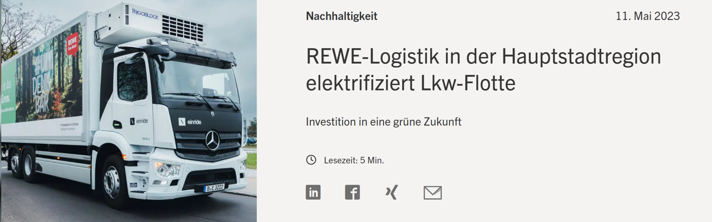
```

---
## Emissionssensitivität allgemein

.col-50[
```{r motivation-c02sense, echo=FALSE, message=FALSE, warning=FALSE, out.width="99%"}
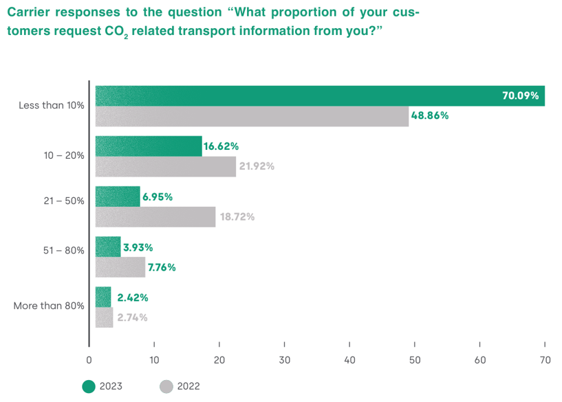
```

`r Cite(bib, "transporeon2024", .opts = list(cite.style = "authoryear"))` 
]
--
.col-50[
```{r motivation-wtp, echo=FALSE, message=FALSE, warning=FALSE, out.width="82%"}
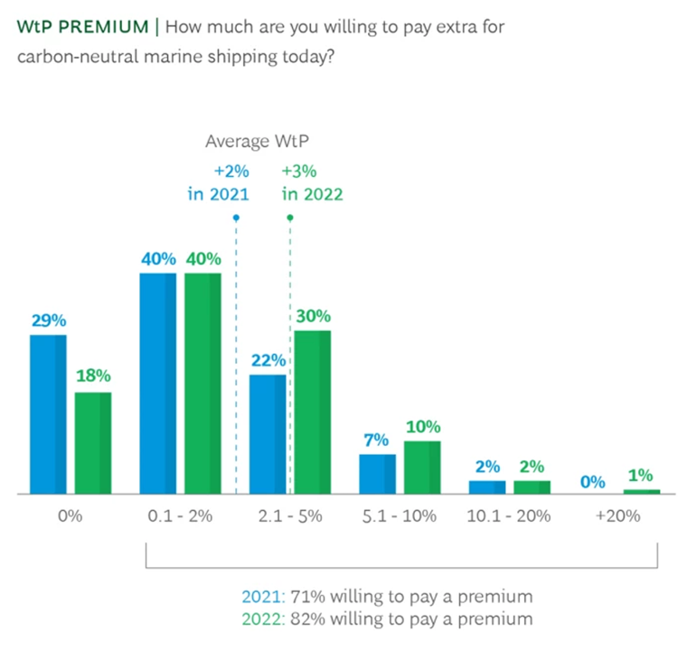
```
`r Cite(bib, "bcg2023", .opts = list(cite.style = "authoryear", max.names = 3, longnamesfirst = FALSE))` 
]

---
## Emission awareness

.col-50[
```{r motivation-accountin, echo=FALSE, message=FALSE, warning=FALSE, out.width="99%"}
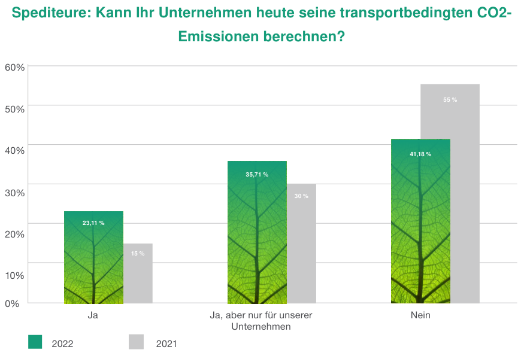
```

`r Cite(bib, "transporeon2022", .opts = list(cite.style = "authoryear"))` 
]
--
.col-50[
```{r motivation-technologies, echo=FALSE, message=FALSE, warning=FALSE, out.width="99%"}
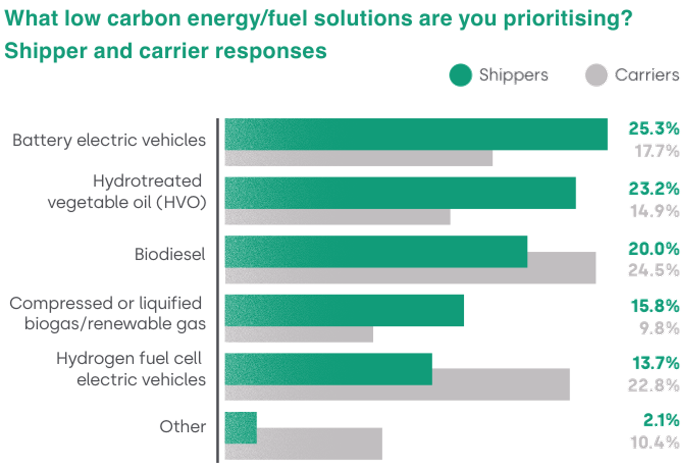
```
`r Cite(bib, "transporeon2024", .opts = list(cite.style = "authoryear"))` 
]

---

## Motivation - Zulassungen von zero-emission vehicles (ZEV)

```{r motivation-zev, echo=FALSE, message=FALSE, warning=FALSE, out.width="88%"}
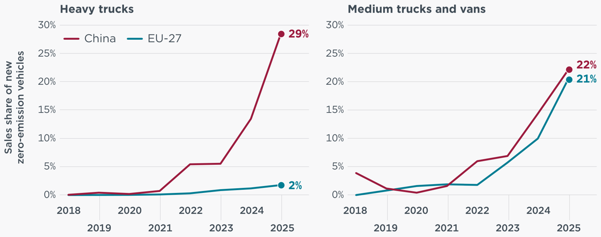
```

`r Cite(bib, "Mulholland2026", .opts = list(cite.style = "authoryear"))` 

---

## Motivation - Zulassung von ZEV-LKW in Deutschland

.col-50[
```{r zulassung-zev-lwk, echo=FALSE, message=FALSE, warning=FALSE}
p <- as.data.frame(zulassung_dtlnd_lwk) |>
  dplyr::select(Jahr, BEV, FC, PHEV, LNG, H2) |>
  tidyr::pivot_longer(-Jahr, names_to = "Technologie", values_to = "Anzahl") |>
  dplyr::mutate(
    Jahr = factor(Jahr),
    Technologie = factor(Technologie, levels = c("H2", "LNG", "PHEV", "FC", "BEV"))
  ) |>
  ggplot(aes(x = Jahr, y = Anzahl, fill = Technologie)) +
  geom_bar(stat = "identity") +
  scale_fill_manual(values = c(
    BEV  = "#5E3EE1",   # HSRM Violett (Sekundaerfarbe)
    FC   = "#9B7FEE",   # Helles Violett (abgeleitet)
    PHEV = "#E00514",   # HSRM Rot (Akzentfarbe)
    LNG  = "#361E47",   # HSRM Dunkelviolett (Primaerfarbe)
    H2   = "#F08080"    # Helles Rot (abgeleitet)
  )) +
  scale_y_continuous(labels = scales::comma_format(big.mark = ".")) +
  labs(x = NULL, y = "Zulassungen LKW (> 3.5 t)", fill = NULL) +
  theme_minimal(base_size = 13) +
  theme(legend.position = "bottom")

plotly::ggplotly(p, width = 500, height= 475) |> #height = 380
  plotly::layout(legend = list(orientation = "h", x = .15, y = -0.15))
```
]

.col-50[
```{r motivation-strategies, echo=FALSE, message=FALSE, warning=FALSE, out.width="95%"}
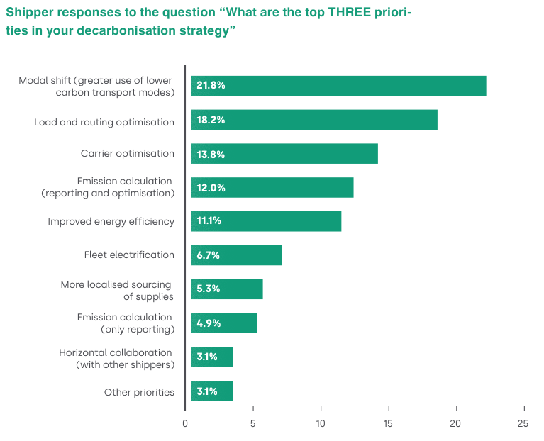
```
`r Cite(bib, "transporeon2024", .opts = list(cite.style = "authoryear"))` 
]

---
class: inverse, center, middle

# Problembeschreibung
---
class: center, middle
## Einordnung Planungsprobleme

.col-50[
```{r problem-operational, echo=FALSE, message=FALSE, warning=FALSE, out.width="99%"}
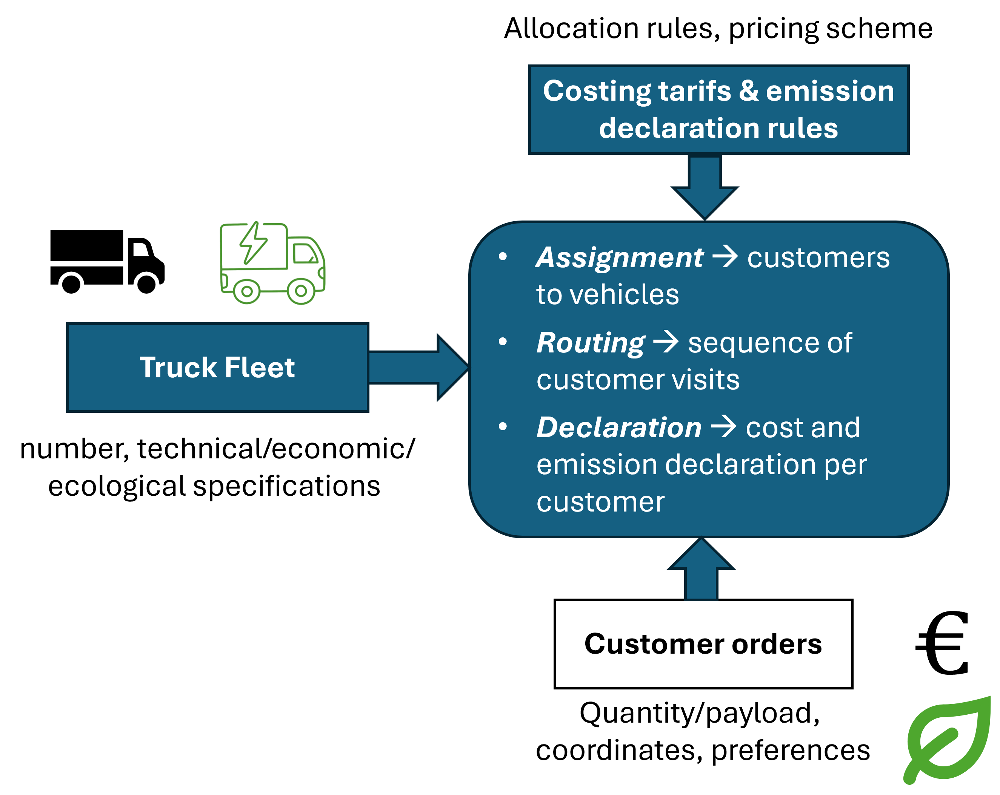
```
]
--
.col-50[
```{r probloem_planning_scheme, echo=FALSE, message=FALSE, warning=FALSE, out.width="99%"}
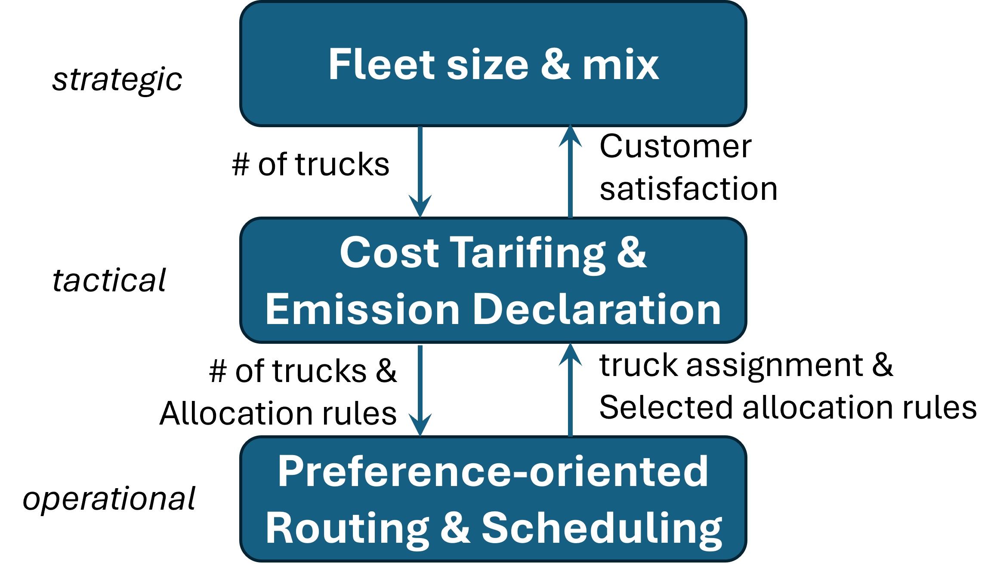
```
]


---
## Beispiel präferenz-orientiertes Routuing (I/III)

.col-50[
.small[
- technologische Annahmen: 
  - TEU-VRP: Güternachfrage in TEU
  - Kapazität: 2 TEU je LKW
  - Nachfrage: 1 TEU je Kunde
  - Flotte: 1 Diesel-LKW, 1 Batterie-LWK
- ökonomische Annahmen:
  - Ziel Kunden: Entweder Kosten- oder Emissionsminimierer
  - Allokation: Kosten und Emissionen einer Tour werden nach Direktdistanz zwischen Depot und Kundenort allokiert
]
$\Rightarrow$ Jede Tour hat maximale Länge von 2 Kunden $\rightarrow$ insgesamt 6 Tourenpläne möglich 
<!-- $\Rightarrow$ mögliche Zielfunktion Spediteur: Maximiere Kundenzufriedenheit $\max \rightarrow \sum_{l \in \mathcal{L}} x_l \cdot  os_{l}$  -->
]
--
.col-50[
```{r beispiel-table1, echo=FALSE, message=FALSE, warning=FALSE}
library(kableExtra)
library(tibble)

tab1 <- tribble(
  ~Parameter,                          ~ActrosL,          ~eActros600,
  "Vehicle data",                  "",                "",
  "Net vehicle price",                 "150,000 €",       "300,000 €",
  "Service life (years)",              "9",               "6",
  # "Days of use per year",              "240",             "240",
  "Annual mileage (km)",               "120,000",         "90,000",
  "Energy consumption",                "33 l/100km",      "103 kWh/100km",
  "Economic variables",            "",                "",
  #"Interest rate",                     "5%",              "5%",
  "Energy price",                      "1.50 €/l",        "0.55 €/kWh",
  "Road toll",                         "1.85 €/100km",    "0.00 €/100km",
  "Fixed cost p.a.",               "",                "",
  "Depreciation (time-dep.)",          "6,667 €",         "16,667 €",
  "Imputed interest",                  "3,750 €",         "7,500 €",
  "Driver wages",                      "60,000 €",        "60,000 €",
  "Total fixed cost",                  "75,417 €",        "90,167 €",
  "Variable cost p.a.",            "",                "",
  "Energy cost",                       "59,400 €",        "50,985 €",
  "Road toll",                         "2,220 €",         "0 €",
  "Total variable cost",               "68,287 €",        "67,652 €",
  "Total vehicle cost p.a.",       "143,704 €",   "157,819 €",
  "Vehicle cost per day",       "314.24 €",  "375.69 €",
  "Vehicle cost per km",       "0.57 €",  "0.75 €"
)

kable(tab1,
      col.names = c("Parameter", "ActrosL (diesel)", "eActros 600 (BEV)"),
      align    = c("l", "r", "r"),
      escape   = FALSE,
      booktabs = TRUE) |>
  kable_styling(font_size = 12, full_width = TRUE,
                bootstrap_options = c("condensed")) |>
  row_spec(0, bold = TRUE) |>
  row_spec(c(1, 6, 9, 13, 14, 17, 18), bold = TRUE, background = "#f0f0f0")
```
]


---
## Beispiel präferenz-orientiertes Routuing (II/III)

.col-50[
Gesamtkosten-optimaler Tourenplan
```{r beispiel-tour-1, echo=FALSE, message=FALSE, warning=FALSE, out.width="99%",fig.width=8, fig.height=8}
plot_vrp_ggplot(tour.id = 1, aspect.ratio = 0.8)
```
]
--
.col-50[
Gesamtemissions-optimaler Tourenplan
```{r beispiel-tour-2, echo=FALSE, message=FALSE, warning=FALSE, out.width="99%",fig.width=8, fig.height=8}
plot_vrp_ggplot(tour.id = 6, aspect.ratio = .8)
```
]

---
## Beispiel präferenz-orientiertes Routuing (III/III)

.col-50[
Präferenz-optimaler Tourenplan
```{r beispiel-tour-3, echo=FALSE, message=FALSE, warning=FALSE, out.width="99%",fig.width=8, fig.height=8}
plot_vrp_ggplot(tour.id = 3, aspect.ratio = 0.8)
```
]
--
.col-50[
```{r beispiel-resdf, echo=FALSE, message=FALSE, warning=FALSE}
library(kableExtra)
library(dplyr)

col_headers <- paste0(res.df$C.Tour, " / ", res.df$E.Tour)

tab <- res.df |>
  select(-C.Tour, -E.Tour) |>
  mutate(across(everything(), \(x) round(x, 2))) |>
  t() |>
  as.data.frame() |>
  setNames(col_headers) |>
  tibble::rownames_to_column("Kennzahl") |>
  mutate(Kennzahl = rep(c("Kosten", "Emiss."), 5))

# Row index in tab: Gesamt=1:2, Kunde A=3:4, B=5:6, C=7:8, D=9:10
# Kosten row for customer i (A=1,B=2,C=3,D=4): 2*i + 1
# Emiss. row for customer i:                    2*i + 2
cust_idx  <- c(A = 1, B = 2, C = 3, D = 4)
highlight <- c(
  setNames(2 * cust_idx[cost_sensitive] + 1, cost_sensitive),  # Kosten rows
  setNames(2 * cust_idx[env_sensitive]  + 2, env_sensitive)    # Emiss. rows
)

# Build bold matrix (rows x scenario columns); TRUE = bold that cell
bold_mat <- matrix(FALSE, nrow = nrow(tab), ncol = length(col_headers))
for (r in highlight) {
  min_col <- which.min(as.numeric(tab[r, col_headers]))
  bold_mat[r, min_col] <- TRUE
}

kbl <- tab |>
  kable(booktabs = TRUE,
        col.names = c("", col_headers),
        align = c("l", rep("r", 6))) |>
  kable_styling(font_size = 12, full_width = TRUE,
                bootstrap_options = c("condensed", "striped")) |>
  pack_rows("Gesamt",  1,  2) |>
  pack_rows("Kunde A", 3,  4) |>
  pack_rows("Kunde B", 5,  6) |>
  pack_rows("Kunde C", 7,  8) |>
  pack_rows("Kunde D", 9, 10)

# Apply bold column by column (column index +1 to skip the Kennzahl column)
for (j in seq_along(col_headers)) {
  kbl <- column_spec(kbl, j + 1, bold = bold_mat[, j])
}
kbl
```
$\Rightarrow$ passende Fahrzeugflotte ist notwendig $\rightarrow$ Wechselwirkung zwischen Zieldimensionen Kosten, Emissionen und Kundennutzen
]

---

## Literaturüberblick: Taxonomie

```{r lit-taxonomy, echo=FALSE, message=FALSE, warning=FALSE}
library(kableExtra)
library(tibble)

# ── Zitationsstrings via RefManageR ──────────────────────────────────────────
keys <- c("Hoff2010", "Fagerholt2010", "Bakkehaug2014", "Zheng2018",
          "Sarangi2023", "Truden2026", "Zackrisson2025",
          "EINRIDE_Fraunhofer_REWE_2025", "Winkelmann2024")

zitate <- sapply(keys, function(k)
  Cite(bib, k, .opts = list(cite.style = "authoryear")))

# ── Taxonomie-Daten ───────────────────────────────────────────────────────────
tax <- tribble(
  ~Quelle,                          ~Problemtyp,                  ~Flottentyp,  ~Ziel,                     ~Zeit,                  ~Stochastizitaet,   ~Modelltyp,              ~Emissionen,
  zitate["Fagerholt2010"],          "Fleet composition",          "heterogen",  "OPEX",                    "mehrperiodisch",       "deterministisch",  "MIP",                   "NB",
  zitate["Bakkehaug2014"],          "Fleet Transition",           "heterogen",  "Kosten",                  "mehrperiodisch",     "stochastisch",     "Stoch. Programmierung", "–",
  zitate["Zheng2018"],              "Fleet Transition",           "homogen",    "OPEX",                    "mehrperiodisch",       "stochastisch",     "Simulation",            "NB",
  zitate["Sarangi2023"],            "Sizing &amp; Routing",       "heterogen",  "Kosten + Emissionen",     "einperiodisch",        "deterministisch",  "Review",                "Ziel",
  zitate["Truden2026"],             "Fleet Transition",           "heterogen",  "TCO",                     "mehrperiodisch (fin.)", "deterministisch",  "MIP",                   "NB",
  zitate["Zackrisson2025"],         "Fleet Electrification",      "heterogen",  "TCO / LCA",               "einperiodisch",        "deterministisch",  "Simulation / LCA",      "Ziel",
  zitate["EINRIDE_Fraunhofer_REWE_2025"], "Elektrifizierung",     "heterogen",  "OPEX",                    "einperiodisch",        "deterministisch",  "Fallstudie",            "NB",
  zitate["Winkelmann2024"],         "Fleet Transition",     "heterogen",  "TCO + Emissionen",               "mehrperiodisch",        "stochastisch",  "dyn. Programm + MIP",       "Ziel"
)
#zitate["Hoff2010"],               "Composition &amp; Routing",  "heterogen",  "Distanz / op. Kosten",    "---",        "deterministisch",  "Review",                "–",
# ── Spaltenköpfe (mit Zeilenumbruch via <br>) ─────────────────────────────────
col_names <- c(
  "Quelle", "Problemtyp", "Flotte",
  "Opt.-Ziel", "Zeitstruktur",
  "Stochastizität", "Modelltyp", "Emissionen"
)

# ── Tabelle ───────────────────────────────────────────────────────────────────
kable(tax,
      col.names = col_names,
      format    = "html",
      escape    = FALSE,
      align     = c("l","l","c","l","c","c","l","c")) |>
  kable_styling(
    bootstrap_options = c("striped", "condensed", "hover"),
    font_size         = 11,
    full_width        = TRUE
  ) |>
  # Spaltengruppen als Header-Ergänzung
  add_header_above(
    c(" " = 2,                    # Quelle + Problemtyp
      "Flottenmerkmal" = 1,       # Flottentyp
      "Optimierung" = 2,          # Ziel + Zeit
      "Unsicherheit" = 1,         # Stochastizität
      "Methodik" = 1,             # Modelltyp
      "Nachhaltigkeit" = 1),      # Emissionen
    bold = TRUE, background = "#EDE7F6"
  ) |>
  # FloTUV-Hauptreferenz hervorheben
  #row_spec(9, bold = TRUE, background = "#EDE7F6") |>
  # Legende unter der Tabelle
  footnote(
    general        = "NB = Emissionen als Nebenbedingung; Ziel = Emissionen als Optimierungsziel; – = nicht berücksichtigt.",
    general_title  = "Anmerkung:",
    footnote_as_chunk = TRUE
  )
```
--
$\Rightarrow$ Projektziel: Entwicklung eines integrierten Simulation-Optimization-Ansatzes für Flottenumbau-Problem unter Berücksichtigung von heterogenen Verladernutzen

---
class: inverse, center, middle

# Projektaufbau

---

## Team & Zuordnung

```{r projekt_team, echo=FALSE, message=FALSE, warning=FALSE, out.width="75%"}
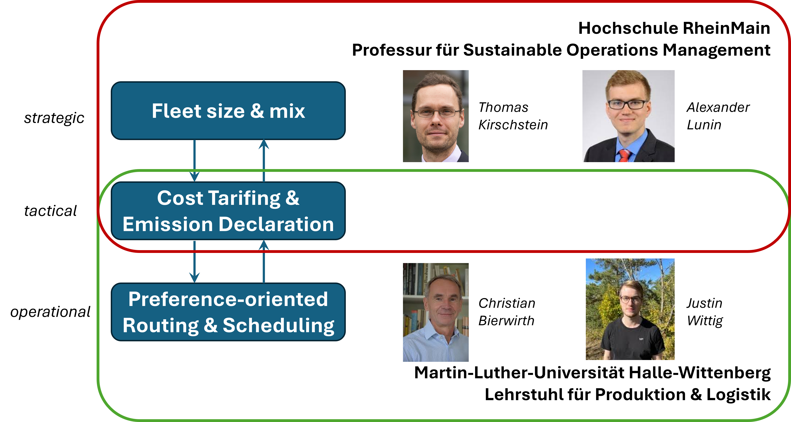
```
---
## Methodische Ansätze

```{r projekt_methoden, echo=FALSE, message=FALSE, warning=FALSE, out.width="77%"}
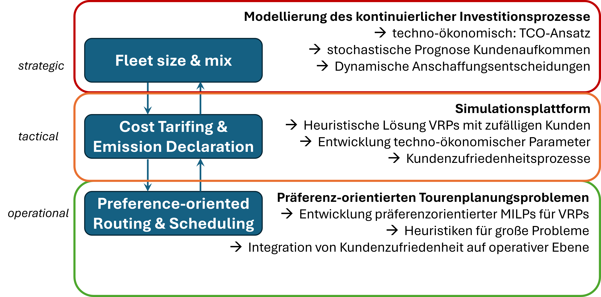
```
---
class: inverse, center, middle

# Ausblick

---

## Ausblick

**Nächste Schritte**

- Formale Modellierung des präferenz-orientierten VRP mit gemischter Flotte $\rightarrow$ Präferenzen und Nutzen
- Modellierungsansatz Flottenplanung $\rightarrow$ dynamische Programmierung vs. rollierendes, mehrperiodiges MILP
- Sammlung techno-ökonomischer Daten von Antriebssystemen $\rightarrow$ B-LKW, H2-LKW, FC-LKW, Gas-LKW, etc.
- Instanzgenerierung auf Basis realistischer Logistikdaten 
- Simulationsrahmen für mehrperiodische Flottenszenarien $\rightarrow$ Einfluss von Infrastruktur und Betriebsmodi
--
.center[
<br>
**Vielen Dank für Ihre Aufmerksamkeit!**

*Fragen und Anmerkungen sind herzlich willkommen.*
]

---
class: small-slide
## Quellen

.small[
```{r references, results="asis", echo=FALSE}
PrintBibliography(bib)
```
]